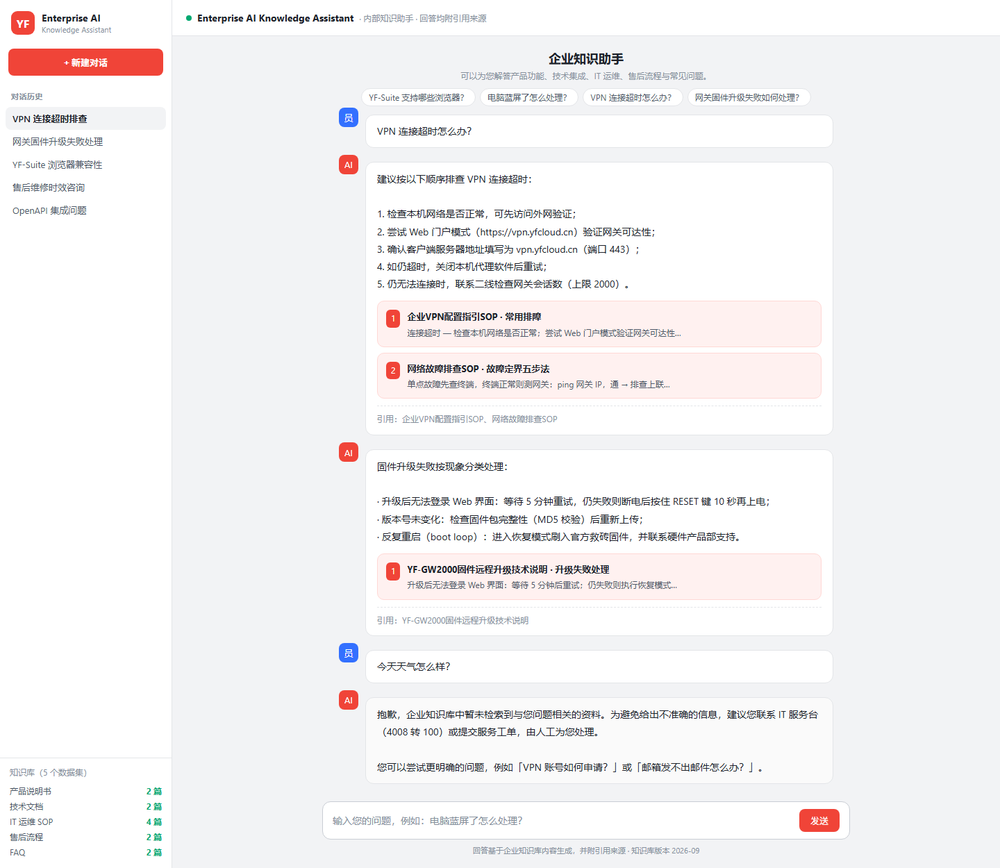
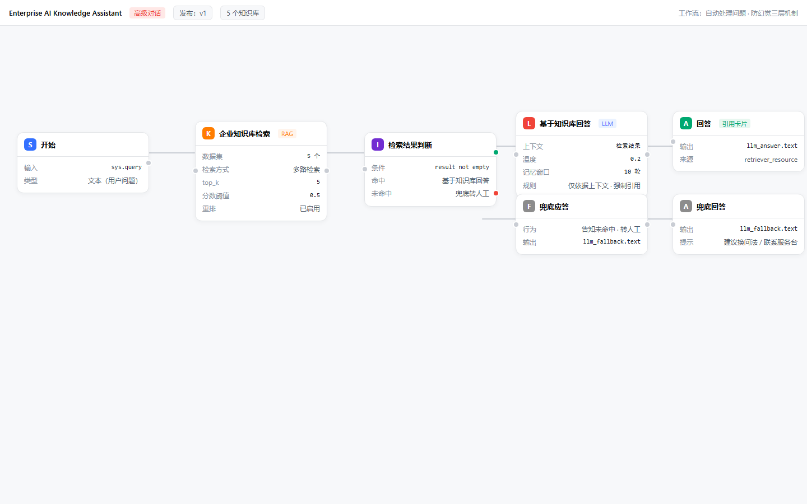
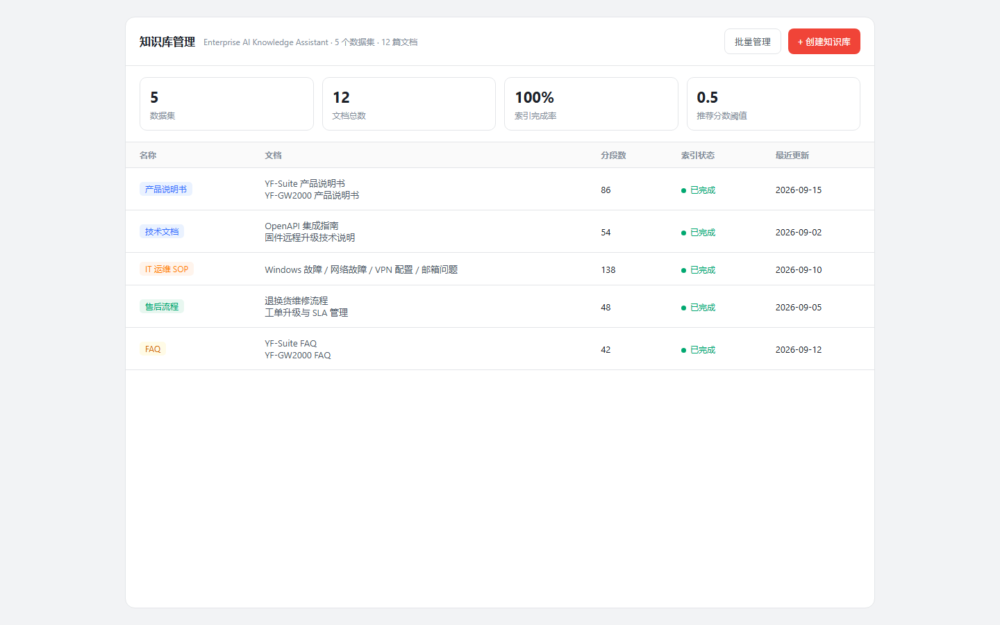

# Enterprise AI Knowledge Assistant

企业级 AI 知识助手 —— 基于 [Dify](https://github.com/langgenius/dify) 平台改造的**企业文档智能问答系统**。

员工与一线客服通过自然语言即可查询**产品说明书、技术文档、IT 运维 SOP、售后流程、FAQ**；AI 回答基于企业知识库内容生成、**强制附引用来源**，检索不到依据时**自动转人工**，从机制上减少幻觉。

> 定位：AI 应用实施工程师作品集项目（配置 + 数据 + 文档层改造，最大化复用上游平台能力，不重构上游代码）。

---

## 1. 项目背景

企业沉淀了大量知识与文档（说明书、手册、SOP、FAQ…），但分散在网盘、Wiki、邮件与老员工经验里。员工与客服检索成本高、回答口径不一致、高频问题重复消耗人力。本项目以开源 LLM 应用平台 Dify 为基础，通过**知识库 + RAG + 工作流编排**，交付一套开箱即用的企业内部知识助手。

## 2. 企业痛点

| 痛点 | 表现 |
| --- | --- |
| 知识分散 | 文档散落多处，检索一次平均 15-30 分钟 |
| 口径不一 | 相同问题不同人回答不一致，SOP 更新后旧内容仍被引用 |
| 依赖人工 | 高频问题占一线人力 40% 以上，重复回答 |
| 幻觉风险 | 通用大模型直接问答会编造，必须基于企业知识库 + 引用溯源 |

## 3. 解决方案

```
用户提问 → 企业知识库检索(RAG, 5 数据集 × 多路检索, 分数阈值 0.5, 重排)
        → 检索结果判断(if-else: result not empty)
             ├─ 命中 → LLM 基于知识库回答（防幻觉提示词 + 引用标注）→ 回答(引用卡片)
             └─ 未命中 → 兜底应答（告知未命中 + 转 IT 服务台/工单）
```

**防幻觉三层机制**：检索侧（分数阈值过滤 + 重排 + top_k 控制）→ 提示词侧（仅依据上下文、无依据明说、强制引用标注）→ 路由侧（无依据不硬答，走兜底转人工）。

## 4. 技术架构

| 层 | 技术 | 说明 |
| --- | --- | --- |
| 平台本体（上游，零改造） | Dify 1.17.1（Next.js 前端 + Flask 后端 + Celery 异步 + PostgreSQL + Redis + Weaviate 向量库） | 官方镜像一键部署，含知识库管理、工作流引擎、模型管理、服务 API |
| RAG 引擎（复用上游） | `api/core/rag`：文档抽取 → 清洗 → 向量化 → 检索（关键词/向量/混合）→ 重排 | `score_threshold`、`reranking`、`top_k` 即防幻觉工程基础 |
| 应用层（本项目交付） | 高级对话 DSL：knowledge-retrieval → if-else → LLM/兜底 | 见 `seed/apps/enterprise-ai-knowledge-assistant.yml` |
| 数据层（本项目交付） | 12 篇企业知识库演示文档，5 大分类 | 见 `seed/knowledge-base/` |
| 部署层（本项目交付） | Docker Compose 环境配置 + Service API 一键导入脚本 | 见 `deploy/` |
| 质量层（本项目交付） | DSL/种子数据自动化校验脚本 | 见 `scripts/`（30 PASS + 48 PASS） |

架构分析详见 [`analysis/ARCHITECTURE.md`](analysis/ARCHITECTURE.md)，改造方案详见 [`docs/TRANSFORMATION.md`](docs/TRANSFORMATION.md)。

## 5. 核心功能

- **文档上传 / 知识库管理**：支持 PDF / Word / Markdown 等格式；5 个数据集按分类管理，命中测试验证检索质量（`docs/DEPLOYMENT.md` 初始化清单第 2、4 步）。
- **RAG 检索**：多路检索 + 分数阈值（0.5）+ 重排模型，中英文混合场景关键词兜底。
- **AI 问答**：高级对话应用，10 轮对话记忆，回答仅依据检索上下文。
- **引用来源**：聊天界面渲染引用卡片，回答末尾标注「引用：[文档名]」，可回溯可审计。
- **对话历史**：Web App 会话管理 + LLM 节点记忆窗口。
- **工作流自动处理问题**：命中回答 / 未命中转人工，一次配置全自动路由。

## 6. 使用截图

> 当前为高保真界面示意图（标注与种子数据、DSL 配置一一对应）；部署真实实例后的拍摄指南见 [`docs/SCREENSHOTS.md`](docs/SCREENSHOTS.md)。

**对话 + 引用来源 + 兜底转人工：**



**工作流画布（自动处理问题）：**



**知识库管理：**



## 7. 快速开始（部署方式）

前置：Docker + Docker Compose v2.24+，内存 ≥ 4 GiB。

```bash
# 1) 拉取上游 Dify（平台本体，官方镜像，无需源码）
git clone --depth 1 https://github.com/langgenius/dify dify

# 2) 应用企业环境配置
cp deploy/docker/.env.enterprise.example dify/docker/.env

# 3) 启动
cd dify/docker && docker compose up -d
# 4) 浏览器访问 http://localhost/install 初始化管理员
```

初始化清单（控制台）：接入模型（LLM / Embedding / Rerank）→ 创建知识库（或一键导入）→ 导入应用 DSL → 绑定数据集 → 发布。

一键导入演示数据：

```bash
pip install requests
python deploy/scripts/seed-kb.py --base-url http://localhost/v1 --api-key dataset-xxxxxxxx
```

完整部署与验证清单见 [`docs/DEPLOYMENT.md`](docs/DEPLOYMENT.md)。

## 8. 演示数据

12 篇文档（虚构企业「云帆科技」），覆盖 5 大分类（`seed/knowledge-base/`）：

| 分类 | 文档 |
| --- | --- |
| 01 产品说明书 | YF-Suite 企业协同平台、YF-GW2000 智能网关 |
| 02 技术文档 | OpenAPI 集成指南、固件远程升级技术说明 |
| 03 IT 运维 SOP | Windows 故障、网络故障、VPN 配置、邮箱问题 |
| 04 售后流程 | 退换货维修、工单升级与 SLA 管理 |
| 05 FAQ | YF-Suite、YF-GW2000 常见问题 |

可演示问答清单与案例说明见 [`docs/CASE_STUDY.md`](docs/CASE_STUDY.md)。

## 9. 测试与验证

```bash
python scripts/validate_seed.py   # 知识库种子数据：48 PASS / 0 FAIL
python scripts/validate_dsl.py    # 应用 DSL：30 PASS / 0 FAIL（含 graphon 引擎 schema 真实验证）
```

## 10. Git 提交说明

建议提交记录（本仓库的改造层已按此组织）：

```bash
git add analysis docs seed deploy scripts screenshots
git commit -m "feat: 基于 Dify 平台改造企业知识助手（配置+数据+文档层）"
```

示例提交序列：

1. `docs: 添加 Dify 架构分析与改造方案（ARCHITECTURE / TRANSFORMATION）`
2. `feat: 添加企业知识库演示数据 12 篇（5 大分类，validate_seed 48 PASS）`
3. `feat: 添加高级对话应用 DSL（知识检索+路由+防幻觉+引用来源，validate_dsl 30 PASS）`
4. `feat: 添加部署配置与一键导入脚本（.env.enterprise.example / seed-kb.py）`
5. `docs: 添加 README、部署说明、案例、截图说明`

> 说明：本仓库为改造层，不含 Dify 上游源码；上游为官方镜像零改造，许可证遵循上游 LICENSE。

## 11. 目录结构

```
enterprise-ai-knowledge-assistant/
├── analysis/          # Dify 架构分析（含源码关键文件快照 dify-src/）
├── docs/              # 改造方案 / 部署说明 / 企业案例 / 截图说明
├── seed/
│   ├── knowledge-base/ # 12 篇演示知识库文档（5 分类）
│   └── apps/           # 应用 DSL（高级对话 + 工作流）
├── deploy/
│   ├── docker/         # 企业部署环境配置示例
│   ├── scripts/        # Service API 一键导入脚本
│   └── seed-config.json
├── scripts/            # 校验脚本（validate_seed / validate_dsl）
└── screenshots/        # 使用截图（界面示意图）
```
